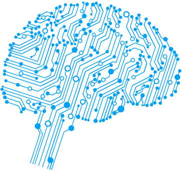
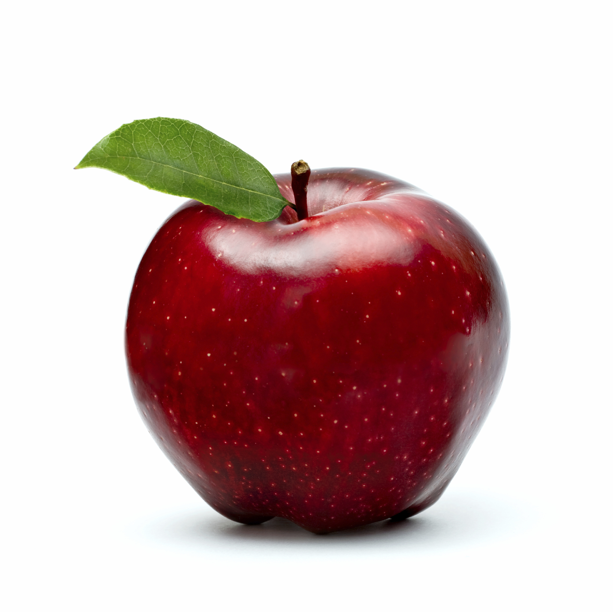
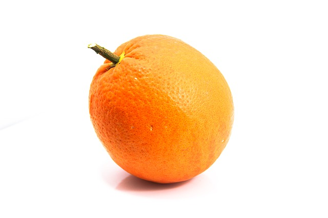
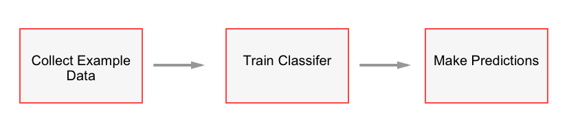

# Introduction to Machine Learning

## Table of Contents

- [Setup](#setup)
	- [Python](#python)
	- [Dependencies](#dependencies)
		- [Windows](#windows)
			- [Numpy](#numpy)
			- [Scipy](#scipy)
			- [SciKit-Learn](#scikit-learn)
		- [MacOS](#macos)
		- [Test Dependencies](#test-dependencies)
- [What is Machine Learning](#what-is-machine-learning)
- [Hello World](#hello-world)
	- [The Problem](#the-problem)
	- [Without Machine Learning](#without-machine-learning)
	- [With Machine Learning](#with-machine-learning)
		- [Supervised Learning Recipe](#supervised-learning-recipe)
		- [Example Input Data](#example-input-data)
			- [Features](#features)
		- [Decision Trees](#decision-trees)
- [Visualizing the Decision Tree](#visualizing-the-decision-tree)


## Setup 

### Python

*Skip this section if you already have Python installed. If you have a version other than `2.7` or `3.6` installed, you may need to install one of those versions.*

Open up [https://www.python.org/downloads/](https://www.python.org/downloads/) in your web browser and choose click either `Download Python 3.6.1` or `Download Python 2.7.13`. The site should automatically determine if you're on Windows/MacOS/Linux and offer you the proper version.

Open the file it downloads and go through the setup.


---

### Dependencies

#### Windows

You may need to run your command line as an administrator. 

##### Numpy

Open [http://www.lfd.uci.edu/%7Egohlke/pythonlibs/#numpy](http://www.lfd.uci.edu/%7Egohlke/pythonlibs/#numpy) in a web browser and click the link that matches your system. You want the "cp##" portion of the link to match your python version, and the number at the end needs to be chosen based on whether you're running 32-bit or 64-bit. 

For example, if you have python 3.6 and have 64-bit windows, you need to click: `numpy‑1.12.1+mkl‑cp36‑cp36m‑win_amd64.whl`

`python -m pip install {path-to-file}`

##### Scipy

Open [http://www.lfd.uci.edu/%7Egohlke/pythonlibs/#scipy](http://www.lfd.uci.edu/%7Egohlke/pythonlibs/#scipy) in a web browser and click the link that matches your system. You want the "cp##" portion of the link to match your python version, and the number at the end needs to be chosen based on whether you're running 32-bit or 64-bit. 

For example, if you have python 3.6 and have 64-bit windows, you need to click: `scipy‑0.19.0‑cp36‑cp36m‑win_amd64.whl`

`python -m pip install {path-to-file}`

##### SciKit-Learn

`python -m pip install scikit-learn`

#### MacOS

Open terminal and run:

`sudo pip install numpy`

`sudo pip install scipy`

`sudo pip install scikit-learn`

---

#### Test Dependencies

Run a python shell in the command line or open IDLE and run:

`import sklearn`

If it doesn't throw an error, you're good to go.

---

## What is Machine Learning

Machine learning can be thought of as a subset or "artificial intelligence". An early example of artificial intelligences was [Deep Blue](https://en.wikipedia.org/wiki/Deep_Blue_(chess_computer)) developed by IBM. Deep Blue was a computer program built to play chess, and could defeat world champions - but that's all it could do.

[AlphaGo](https://en.wikipedia.org/wiki/AlphaGo) is a piece of software developed by Google to play the board game `Go`.  AlphaGo excelled in the world championship in 2016. The great thing about AlphaGo was that the same program can be taught to play other video games with very little modification. Machine learning is what makes that possible.

- **Machine Learning**
	- `Machine learning is the subfield of computer science that gives "computers the ability to learn without being explicitly programmed."`

## Hello World

### The Problem

Let's say you want to write a program to classify pictures of fruit - specifically apples vs oranges. How would you go about doing this?




### Without Machine Learning

You might start by trying to compare the number of red pixels to the number of orange pixels. The ratio will give you a hint on what type fruit it is. This could work on very simple images like the ones above, but not with real world applications. What if the images are black and white?  What if the image doesn't contain the fruit at all? You'll end up writing a lot of rules.

```python
def findColors(image):
	# lots of manual checks

def findEdges(image):
	# lots of manual checks

def findShapes(image):
	# lots of manual checks

def determineFruit(image):
	# lots of manual checks

def handleProbability(image):
	# lots of manual checks
```

The worst part about this is that if you were given a new problem you would need to start all over again and write new, unique rules. Machine learning solves this problem for us.

### With Machine Learning

We need an algorithm that figures out the "rules" for us, instead of us writing them on our own. To do this, we're going to train a `Classifier`.

A classifier takes some data as input, and returns a label as output. For example you might have an image of an apple as input, and it would return "Apple" or "Orange" as the label. Or as a real world example, Google Mail's spam filter might take an email as input, and it will return "Spam", or "Not Spam" as the label.

We create this classifier automatically using `Supervised Learning` - we give it examples to learn from.

#### Supervised Learning Recipe



### Code

Create a new file in IDLE or your text editor of choice and save it as `hello-machine-learning.py`. The module we're going to be using to create our classifier is called `sklearn`, so start by adding the import, running, and making sure it runs smoothly:

```python
import sklearn
```

#### Example Input Data

Our input for the classifier to learn from will be *descriptions* of fruits. A description will be a list containing values describing different properties: `weight` and `texture`. We'll also need to label the example descriptions as "apple", or "orange", so that our classifier can learn. 

Here's a set of data that we can translate into python code:

| Weight | Texture | **Label** |
| :------|:-------:|----------:|
| 140g | smooth | **apple** |
| 130g | smooth | **apple** |
| 150g | bumpy | **orange** |
| 170g | bumpy | **orange** |

Let's write some code:

```python
import sklearn

features = [(140, "smooth"), 
			(130, "smooth"), 
			(150, "bumpy"), 
			(170, "bumpy")]

labels = ["apple", "apple", "orange", "orange"]
```

In the above code, `features` and `labels` are related lists. This means that `features[0]` is mapped to `labels[0]` -- the feature `[140, "smooth"]` (140g and smooth) is mapped to `"apple"`.

I wrote the code the way I did above for the sake of conciseness and readability when you look at features and labels in code for the first time. But to actually build our classifier, `sklearn` needs only ints in our features and labels. So let's amend the code to use variables mapped to ints like this:

```python
import sklearn

textureSmooth = 0
textureBumpy = 1

labelApple = 0
labelOrange = 1

features = [(140, textureSmooth), 
			(130, textureSmooth), 
			(150, textureBumpy), 
			(170, textureBumpy)]

labels = [labelApple, labelApple, labelOrange, labelOrange]
```

Now our training data is ready to go.

##### Features

In our example, *weight* and *texture* are what's called in machine learning as a `feature`. A good feature makes it easy and reliable to use a classifier to determine types of fruit, or anything else you might write a classifier for.

#### Decision Trees

There are many different types of classifiers in machine learning:

|Classifier|
|----------|
|Decision tree|
|SVM|
|Bayesian|
|Neural Network|
|K Nearest Neighbors|
|QLearning|
|Genetic Algorithm|
|Markov Decision Processes|
|Convolutional Neural Networks|
|Linear Regression or Logistic Regression|
|Boosting, Bagging, Ensambling|
|Random Hill Climbing or Simulated Annealing|

We're going to use a **decision tree** - one of the more basic classifiers. Decision trees are built into `sklearn`, so let's amend our import statement to:

```python
from sklearn import tree
```

Next we're going to create a `DecisionTreeClassifier`, and then train it with `features` and `labels`.

```python
from sklearn import tree

textureSmooth = 0
textureBumpy = 1

labelApple = 0
labelOrange = 1

features = [(140, textureSmooth), 
			(130, textureSmooth), 
			(150, textureBumpy), 
			(170, textureBumpy)]

labels = [labelApple, labelApple, labelOrange, labelOrange]

classifier = tree.DecisionTreeClassifier()
classifier = classifier.fit(features, labels)
```

Now our classifier is ready to make predictions.

Let's say that we gave our classifier this description:

```python
(160, textureBumpy)
```

What would you predict that this is a description for an apple or an orange? Let's plug it into the classifier and see what it says.

```python
from sklearn import tree

textureSmooth = 0
textureBumpy = 1

labelApple = 0
labelOrange = 1

features = [(140, textureSmooth), 
			(130, textureSmooth), 
			(150, textureBumpy), 
			(170, textureBumpy)]

labels = [labelApple, labelApple, labelOrange, labelOrange]

classifier = tree.DecisionTreeClassifier()
classifier = classifier.fit(features, labels)

print(classifier.predict([(160, textureBumpy)]))
```

Now you can run the program, and you'll see either `[0]` or `[1]` printed, which matches `labelApple` or `labelOrange`.

Try some different descriptions and try adding some more example data and see how the output changes.

